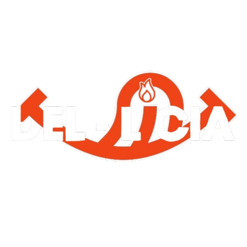

<div align="center">
  
</div>

# Bem-vindo ao "Del-Licia!"

### 🥘 O app com as melhores receitas de todo o Brasil!

---

## Objetivo

**Del-Licia** é um app de receitas totalmente brasileiras, organizadas de acordo com as cinco regiões do nosso país. Nosso objetivo é oferecer receitas práticas, deliciosas e divertidas, tornando a experiência culinária acessível e agradável para todos!

## 🚀 Como Rodar o Projeto

1. **Clone o repositório:**
   ```bash
   git clone https://github.com/seu-usuario/AppReceita.git
   cd AppReceita
   ```

2. **Instale as dependências:**
   ```bash
   npm install ou npm i
   ```

3. **Inicie o servidor:**
   ```bash
   npm run start ou npx expo start
   ```

4. **Acesse a aplicação:**
   Abra seu app Expo Go e acesse `exp://192.168.0.106:8081`.

## 📂 Estrutura de Pastas

A estrutura de pastas do projeto é a seguinte:

```
AppReceita/
├── assets/
├── src/
│   ├── components/
│   │   ├── BannerHome/
│   │   │   ├── banner.js
│   │   │   └── style.js
│   │   ├── Button/
│   │   │   ├── index.js
│   │   │   └── style.js
│   │   ├── Input/
│   │   │   ├── index.js
│   │   │   └── style.js
│   │   ├── NavBar/
│   │   │   ├── navbar.js
│   │   │   └── style.js
│   │   └── RatingStar/
│   │       ├── rating.js
│   │       └── style.js
│   ├── pages/
│   │   ├── Cadastro/
│   │   │   ├── cadastro.js
│   │   │   └── style.js
│   │   ├── Categoria/
│   │   │   ├── categoria.js
│   │   │   └── style.js
│   │   ├── DetalheReceita/
│   │   │   ├── detalhe.js
│   │   │   └── style.js
│   │   ├── Home/
│   │   │   ├── home.js
│   │   │   └── style.js
│   │   ├── Login/
│   │   │   ├── login.js
│   │   │   └── style.js
│   │   ├── Perfil/
│   │   │   ├── perfil.js
│   │   │   └── style.js
│   │   ├── ReceitasPorCategoria/
│   │   │   ├── receitasPorCategoria.js
│   │   │   └── style.js
        └── Splash/
│   │       ├── splashscreen.tsx
│   ├── routes/
│   │   ├── routes.js
│   ├── services/
│   │   │   ├── apiReceitas.js
├── package.json
├── package-lock.json
├── vite.config.js
└── index.html
```

---

## 🙌 Créditos

O app de receita Del-Licia é resultado do esforço colaborativo de uma equipe apaixonada por criatividade, humor e tecnologia. Agradecemos a todos que contribuíram para tornar essa ideia realidade:

<div align="center">
  <table>
    <tr>
      <td align="center">
        <a href="https://github.com/Suru13">
          <br>
          <sub><b>Suru William</b></sub>
        </a>
      </td>
      <td align="center">
        <a href="https://github.com/AnaCarolinaPGDO">
          <br>
          <sub><b>Ana Carolina</b></sub>
        </a>
      </td>
      <td align="center">
        <a href="https://github.com/elipekkkj">
          <br>
          <sub><b>Luis Filipe</b></sub>
        </a>
      </td>
      <td align="center">
        <a href="https://github.com/delmiraugusto">
          <br>
          <sub><b>Delmir Augusto</b></sub>
        </a>
      </td>
      <td align="center">
        <a href="https://github.com/JoaoGLinhares">
          <br>
          <sub><b>João Linhares</b></sub>
        </a>
      </td>
    </tr>
  </table>
</div>
